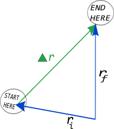

01-10-2024

# Constant Velocity Motion 

[lecture and notes](https://d2l.msu.edu/d2l/le/content/2111213/viewContent/15114318/View)

The simplest model of motion is for an ovject that moves in a straight line at constant speed. 

## Motion (Changes of Position)

**Displacement** vector quantity that descrives a change in position

displacement vector describes change in a vectors position in space
∆r = rfinal - rinit = rf - ri

## Velocity and Speed

**Velocity** is a vector quantitiy that describes the rate of change of the displacement

### Avg Velocity

[Avg Velocity example](https://msuperl.org/wikis/pcubed/doku.php?id=183_notes:examples:averagevelcompare)

**Average Velocity** ddescrubes how an object changes its displacement in a given time. Need the objects position at two different times to compute avg velocity

V = d/t

### Insantaneous Velocity

**Average Velocity** how quickly an obj is moving at a specific point in time.

calculated: v = lim as t approaches 0 of ∆r/∆t = dr/dt

## Speed

**Speed** is a scalar quantity that descirbes that distance (not displacement) traveled over an elapsed time

s = d/t 
d = total dist traveled
t = total time elapsed

### Whats so special about constant velocity motion?

[Predicting Location of obj using constant velocity motion](https://d2l.msu.edu/d2l/le/content/2111213/viewContent/15114318/View)

 rf = ri + (vavg)Δt

There are no external influences on motion when we consider constant velocity over a period because it is an approximation.