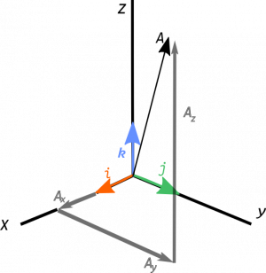
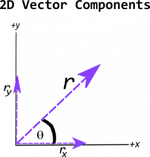
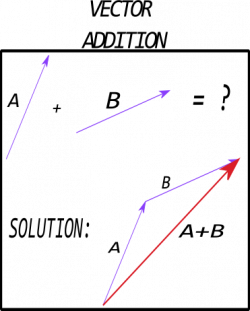
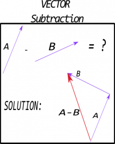

01-09-2024

## Scalars and Vectors

[online lecture](https://msuperl.org/wikis/pcubed/doku.php?id=183_notes:scalars_and_vectors)

**Scalars** are quantities that can be represented by a single number. Numbers include mass, volume, density, speed
**Vectors** are quantities w/ magnitude && direction. Include displacement, velocity, momentum, force

### Defining Vectors Mathmatically

Defined in three dimensional space relative to some origin, tail of the vector is located here. Components can be represented by bracket notation : 
r = ((rx), (ry), (rz))

### Length of a Vector

**Magnitude** or length is a scalar quantity and can be represented mathmatically by: 
([Pythagorean theorem](https://en.wikipedia.org/wiki/Pythagorean_theorem) in three dimensions)
r = sqrt(rx^2 + ry^2 + rz^2)

### Unit Vector

[example](https://msuperl.org/wikis/pcubed/doku.php?id=183_notes:examples:unitvector)

The **unit vector** is defined as the ratio of the vector itself to its magnitude. Vector has no unit of its own

r = (rx, ry, rz)/(sqrt(rx^2, ry^2, rz^2))

Any vector can be written as product of magnitude by:
r = abs(r)*r

### Determining Vector Components in Two Dimensions
[example](https://msuperl.org/wikis/pcubed/doku.php?id=183_notes:examples:vectordecomposition)

rx = abs(r)(cost)
ry = abs(r)(sint)
A snot-nosed brat in a truck observes a billboard appearing to move -25m/s to the east (v⃗ B/T, east being in the +x direction), while a skater appears to be skating 23.82m/s, 34∘ north of west (v⃗ S/T, north being in the +y direction, west in the −x direction). What is the velocity of the skater relative to the billboard (v⃗ S/B)?

### Adding and Subtracting Vectors

A + B = (ax, ay, az) + (bx, by, bz) = (ax + bx, ay + by, az + bz)
A - B = (ax, ay, az) - (bx, by, bz) = (ax - bx, ay - by, az - bz)

**Addition**: Place the tail as the second vector and the tip as the first. red is the addition vector

**Subtraction**: Draw vector that points directly opposite the second vector. red is the difference vector

 