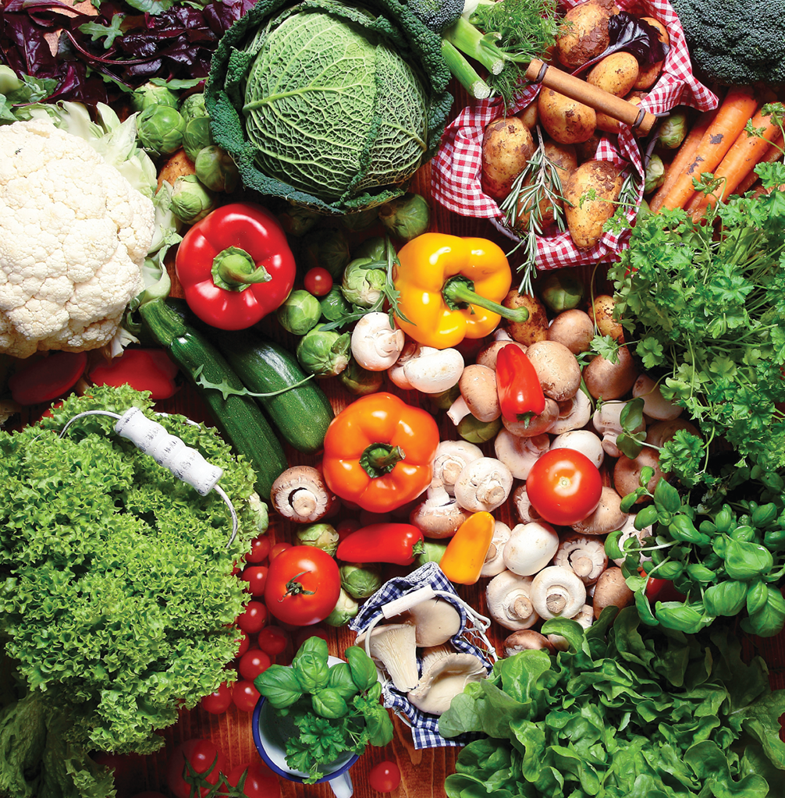
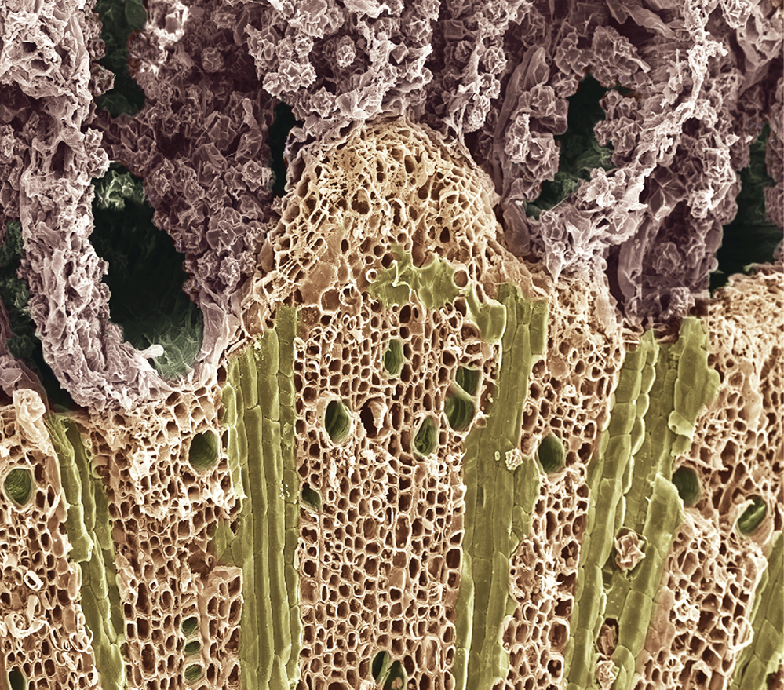
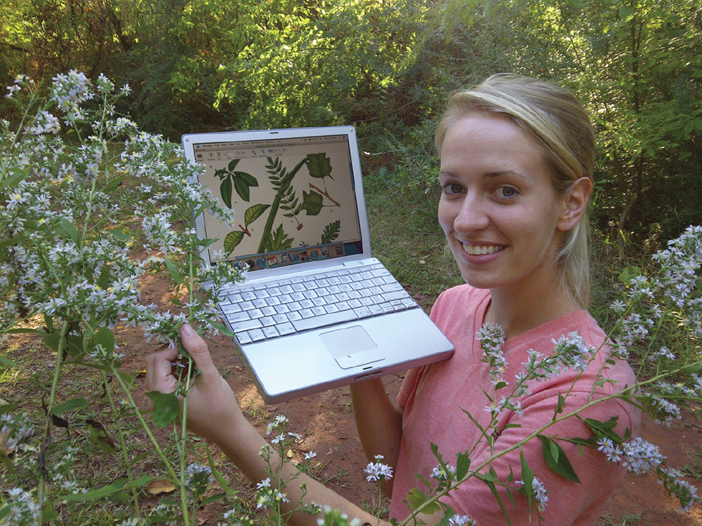

01-17-24

# Intro 1.1

- Plant life = 98% of life
- Backbone of life = carbon, captured by plants for from CO2
- without plants life would suffocate in 11 years
- Tropical rainforest = 14% of earths surface area formerly now 6%
- 137 species destroyed everyday
- 97% of worlds food = plants
- opoids in US took 42k lives and $504 billion in 2016-17
- Plants can eat animals
- Redwood/Sequoia can grow to 90 meters

# Humans vs Environment 1.2

- California only has 5% of wetlands it had 100 years ago
- We gotta reduce reuse and recycle

Trees
- construct houses w/ lumber
- use cellulose for paper carboard and synthesized fibers

Coal
- focilized plant material

# Botany as a Science 1.3

**Science** - seach for knowledge of the natural world

**Botany** - study of plants
**Hypothesis** - tentative, unproven explanation for something that has been observed

Expirement 
- test group - receivees the experimental treatment
- control - doesnt receive treatment
- accumulate **data** and can lead to generalization called **principle**
- Several related principles lead to **theory** - more than a guess

# Diversitfication of Plant Study 1.4

**Plant Anatomy** - study of internal structure of plants
- Anatomists: Marcello Malpighi stem/root tissue, Nehemiah Grew (17th century) wood structure

**Plant Physiology** - study of plant function, found by JB van Helmont (16th century)
- First who demonstrated plants have different nutritional needs from animals

Modern Plant physiology
- use cloned **genes** - units of heredity that are found within nuclei of the cells to learn more about plant functions

**Plant Taxonomists** - Botanists who specialize in identifying naming and classifying of plants

**Plant Systematics** - same as taxonomy but broader, science of developing the grouping of organisms

**plant geography** - study of how and why plants are distributed where they are, not developed til 19th century

**Plant Ecology** - Study of interactions of plants with one another and their environment

**Plant Morphology** - subdiscipline of botany concerned with the form and structure of plants?

**Genetics** - Science of heredity

**Bioinformatics** - combines biology, statistics and computer science to analyze the huge data sets being generated by DNA and RNA sequencing efforts

**Cell Biology** - Science of cell structure and funcion

**Economic botony and ethnobotony** - focuses on practical uses of plants and plant products

The study of the interaction of plants with one another and with their environment is known as plant **ecology**

**plant breeding** - subdiscipline of genetics has improved the quality of crop plants as well as crop yields

