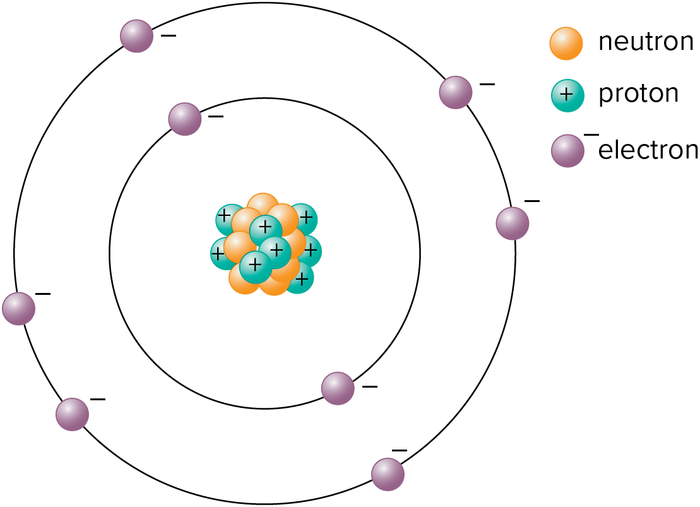
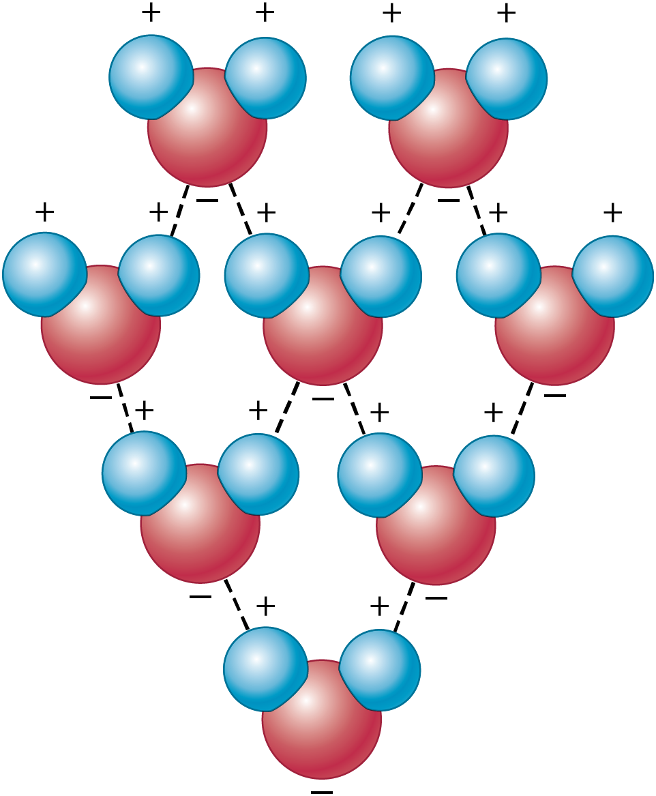
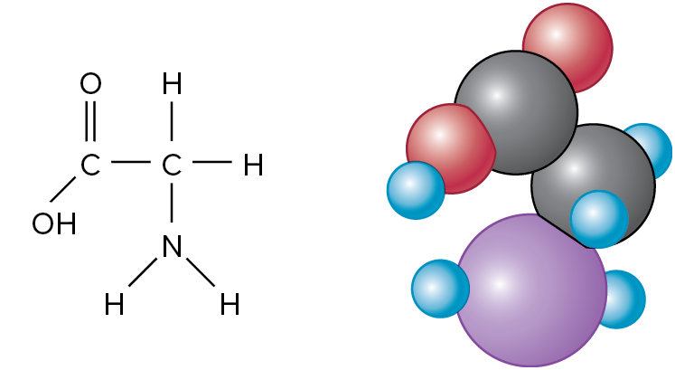

01-17-2024

# Nature of Life - Chapter 2

[Book link](https://prod.reader-ui.prod.mheducation.com/epub/sn_25bf2/data-uuid-9ca12d5e376d434cbd1caed2b022096a)

## 2.1 Attributes of Living Organisms 

### Organization and Structure

- Cells contain genetic material called **DNA**(deoxyribonucleic acid) house in nucleus that is suspended in the cytoplasm
- **Cell** - cytoplasm bound by a very thin membrane
- In bacteria DNA is not in the nucleaus
- Plants algae fungi and bacteria have **cell wall** outside the membrane for rigidity
- Cells composed of **molecules** (smallest units/elements if a compound)
- Bacteria are simplest known cells, each cell contains min of 600 diff kinds of proteing and hundreds of other substances
- **Matter** - Composed of elements, has mass, occupies space

### Growth

- increase in mass = **growth**
- usually accomponied by increase in volume
- growth results from production of new cells which cause variation in form
- growth is controlled by geenetic makeup and environment

### Reproduction

- Offspring resemble the parents

### Response to Stimuli

- **callose** is substance plugged in by plants into pierced tissue
- **callus** = mass of cells formed at the smae site 
- plants respond to injury and other stimuli such as light, temp, gravity

### Metabolism

**Metabolism** - collective product of all the biochemical reactions taking place within an organism

- **respiration** - energy releasing process
- **photosynthesis** - energy-harnessing process in green cells thats associated with energy storage
- **digestion** - breakdown of food molecules
- **assimulation** conversion of raw materials into cytoplasm and other cell substances

## 2.2 Chemical and Physical Bases of life

### Elements: Units of Matter

- basics of universe - stuff exists as *solid, liquid and gas* 
    1. Occupies space
    2. has mass - most of the times weight too
    3. composed of **elements** - 98 naturally occuring on earth
- smallest subdivision of an element is an **atom** - consisting of necleus which consists of protons and neutrons

- atoms live about 10^35 years
- Region around necleus is an **orbital**

### Combos of Elements

- two or more elements untied in a defintie ratio by chamical bonds is called a **compound**
- **molecule** - two or more atoms bound together and is the smallest independently existing particle of a compound or an element
- collisions between molecules capable of sharing electrons are the basis for all chemical reactions
- once they colide they can form a cohesive netweork as positive atoms are attracted to negative atoms of the molecules
- **Cohesion** - ex. water molecules attracted to other water molecules
    - polarity of water is partly responsible for the movement of water molecules through fine tubes such as those in wood and other plant parts

- **Adhesion** - Water molecules attracted other negatively charges molecules (such as fibers)

### Valence

- Ability of an element to combine with another one is based on electron number called **valence**

### Bonds And Ions

- Covalent vs ionic vs hydrogen
- **ionic** - bonds are formed when there is an attraction between oppositely charged ions
- **ions** - Molecules that lose or gain electrons

### Random Definitions

refer to chapter for more info

**Sun** - ultimate source of energy on earth

**energy** - capacity to do work or produce change

**Acids** - chemicals that release hydrogen ions (H+) when dissolved in water, make more hydrogen than hydroxyl ions
    - taste sour

**Bases** - compounds that release negatively charged hydroxyl ions (OH-) when dissolved in water

**pH Scale** - Concentration of H+ ions is used to define degrees of acidity or alkalinity on pH 
    - equal H+ and OH- @ 7
    - lower the number = higher the acidity and vice versa

**Thermodynamics** - study of energy and conversions from one form to another
    - First law = Energy is constant and therefore cannot be gained or lost
    - Second law = Energy flows from a high to low state

## Chemical Components of Cells

**Polymers** large molecules (macromolecules) formed of smaller **monomers** bonded together

### Carbohydrates

Most abundant organic compounds in nature

**Monosaccharides** - simple sugars with backbones of three to seven carbon atoms
    - Glucose and fructose

**Disaccharides** - two monosaccharides bonded together by dehydration synthesis

**Polysaccharides** - more than two monosacchs bonded together

**Cellulose** - chief structural polumer in plant cell walls, polysacch

### Lipids

fatty or oily substances that are mostly insoluble in water because they do not have polar regions
    - They typically store twice as much energy at similar amounts of carbohydrates

**Fats** - solid lipids at room temp

**oils** - liquid lipids at room temp

### Proteins, Polypeptides and Amino Acids

**Proteins** - second only to cellulose in making up the dry weight of plant cells
    - regulate chemical reactions
    - occur in each kind of organism in unique combos and give them distinct characteristics

**Polypeptides** - chains of amino acids
    - 20 different kinds of amino acids
    - 50 to 50,000 or more are present in each protein molecule
    - Aminos linked together by **peptide bonds** - covalent bonds formed between carboxyl carbon of one amino acid and the nitroge of the amino group of another in a dehydration reaction

**Storage proteins** - tubers, onions store additional proteins within carbs in their food storage organs

**Enzymes** - Large complex proteins that function as organic catalysts under specific conditions of pH and temperature
    - break down bonds and allow new ones to form

**Nucleic Acids** - exceptionally large complec polymers originally though to be confined to the nuclei of cells but now known also to be associated with other cell parts
    - Vital to normal internal communication and functioning of all living cells 
    - examples include *ribonucleic acids* & *deoxyribonucleic acids*