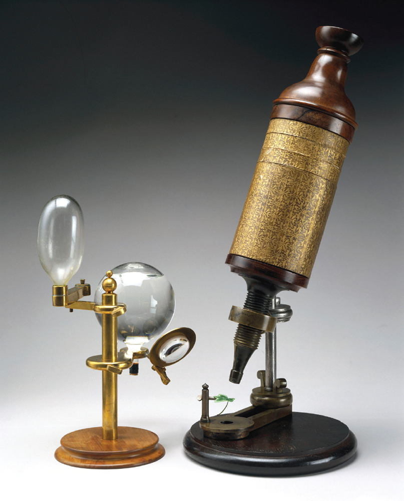
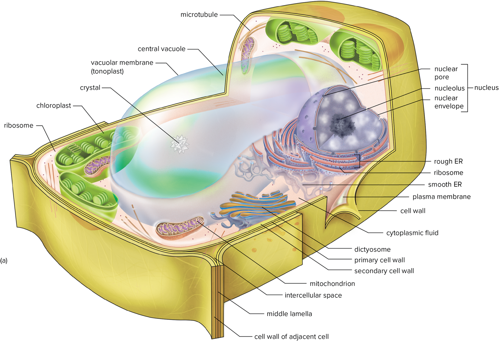
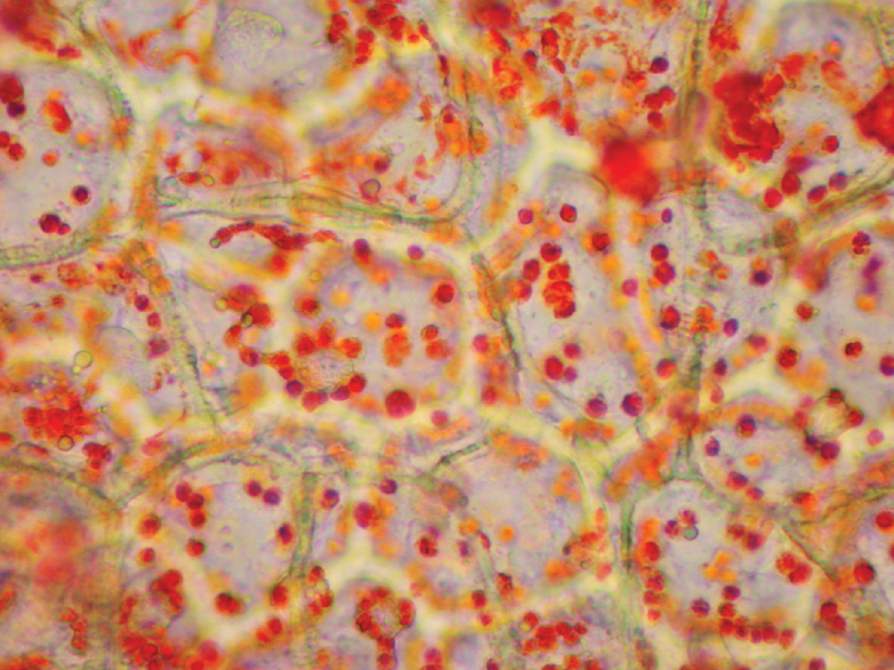

01-20-2024

# Cells - Chapter 3 

- [3.2](#32-history-of-cells)
- [3.3](#33-eukaryotic-v-prokaryotic-cells)
- [3.4](#34-cell-structure-and-communication)
- [3.5](#35-cellular-components)
- [3.6](#36-cellular-reproduction)

## 3.2 History of Cells 

- 1665 - First discovered by Robert Hooke by looking at slices of cork in stoppered wine bottles

- 1670 - Malpighi, Grew and van Leeuwenhoek studed organization of cells over 50 years
- 1831 - Brown discovered nucleus then Schleiden observes smaller body within nucleus
- 1838 - Schleiden and Schwann develope **cell theory** - all living organisms composed of cells
- 1858 - Virchow argues every cell comes from a previous cell, no psontaneous generation of cells
- 1862 - Pasteur proves Virchow 
- 1871 - Pasteur proved natural alcoholic fermentation involves activity of yeast cells

### Modern Microscopes

In **light microscopy**, magnifications of more than 1500x are considered "empty" because at this point, increases in magnification are no longer accompanied by increases in **Resolution**

**Dissecting Microscope** - allow the observer to see a three dimensional image of an opaque object

## 3.3 Eukaryotic v. Prokaryotic Cells

**Prokaryotic** - cells without nuclei

**Eukaryotic** - cells with nucleus
^ both have cell walls

**Endosymbiotic theory** - some cell components (chloroplasts and mitochondria) evolved when large eukaryotic cell engulfed independent prokaryotes

**organelles** - membrane-bound structures with specialized functions

## 3.4 Cell Structure and Communication 

**Protoplasm** - encompasses all the living components of the cell

**Cytoplasm** - all cellular components between the plasma membrane and a relatively large body called nucleus
    - contains soulike fluid called cytosol
    - organelles (mostly bound by membranes) are dispersed in the cytosol

### Cell Size

- generally between 10 and 100 micrometers
- 25,000 micro-m in an inch, 500 cells per inch (2.54 cm)

### Cell Wall

- cellular structure provides a a plant with mechanical strength and helps maintain cell shape
- protector
- Most abundant and diverse of biological structures on earth
- **middle lamella** - layer of pectin, first produced when new cell walls are formed

### Communication between Cells

- **plasmodesmata** - tiny strands of cytoplasm that extend through cells
    - help fluids and dissolved substances pass through primary walls of adjacent cells

## 3.5 Cellular Components

**Plasma membranes** - outer boundary of cell
    - eight-milionths of a millimeter thick
    - semipermeable barrier, which can allow, inhibit, or regulate the movement of substances in and out of the cell

### Nucleus

- repository of the genetic information that enables the synthesis of nearly all proteins in a living eukaryotic cell
- control center of the cell
- houses most of the DNA in a eukaryotic cell
- **nuclear envelope** - two membranes that bind the nucleus

- **Nucleoli** - larger nuclear body, composed primarily of RNA and other proteins
- **Chromatin** -become **chromosomes** when nucleus divides, composed of protein and DNA

### Endoplasmic Reticulum (ER)

- outer membrane of the nucleus is connected to this thing, also continuous with it
- it facilitates cellular communication and channeling of materials
- Enclosed space consisting of a network of flattened sacs and tubes that form channels through the cytoplasm

- Cells that carry out extensive lipid synthesis dont have more rough ER compared to smooth ER
- membrane lipids are usually synthesized and secreted by the **smooth** ER
- Protein synthsis, storage and secretion occur in the **rough** ER

### Ribosomes

- tiny bodies, visible with electron microscope
- ellipsoidal in shape, made of two subunits made of RNA and proteins
- link amino acids together in the construction of complex protein/polypeptide molecules

### Dictosomes

- Stacks of flattened discs or vesicles scattered throughout cytoplasm
    - Cell wall polysaccharides, floral nectars, and essential oils are examples of substances packaged and secreted here
- involved in the modification of carbohydrates attached to proteins 
    - later stored in ER

### Plastids

- Several kinds found in cells, chloroplasts are and example
- **Chloroplasts** - shaped like rugby football- algae may only have one or two but other plants have 75 to 125, surronded by two membranes
- corkscrew like ribbons
- contain **grana** - stacked **thylakoids** which contains **chlorophyll**
- **stroma** - colorless fluid matrix that make up the liquid portion of chloroplasts
- **Chromaplasts** - different type of plastid in complex plants
- **Leucoplasts** - different type of plastid in complex plants
- **Proplastids** - organelles which are precursors to plastids

^ chromoplasts in a pepper

### Mitochondria

- Powerhouse of the cell!
    - Within them energy is released from organic molecules via *cellular respiration*
- energy keeps the cells functioning
- cellular organelles inside of which chemical energy stored within the covalent bonds of organic molecules is harvested for use by the cell

### Microbodies

- spherical organelles
- contain enzymes bound by a single membrane
- **Peroxisomes** - contain enzymes needed for plants to survive hot conditions
- **Glyozisomes** - contains enzymes that aid in the conversion of fats to carbs during germination of seeds containing fats

### Vacuoles

90% or more of volume of living plant cells are taken up by two central vacuoles
    - bound by vacuolar membranes (tonoplasts)
- Maintain cell pH and store cell metabolites adn waste products
- regulate cell pressure
- **Cell sap** - inner fluid of vacuole, slightly acidic

### Cytoskeleton

Involved in movement within cell and the cells architecture
    - made of microfilaments and **microtubules**
**Microfilaments** - play a role in the contraction and movements of cells in multicellular animals

## 3.6 Cellular Reproduction

### Cell Cycle

Series of events that occur when cells divide
    - two phases, interphase and mitosis

### Interphase

- G1, 
- S - (sythesis) produces DNA replication
- and G2
- Living cells that are not divisible, chromosomes not visible with light microscopes here
- longest phase of cycle

### Mitosis

- Dividing of cells - happens in 4 ambiguous phases described below
- occurs in an organism until it dies
- ensures two new cells resulting from a cell undergoing mitosis each have precisely equal amounts of DNA 
- **cytokinesis** occurs right after mitosus, cytoplanm divides and produces two distinct daughter cells

#### Prophase 

- Main features:
    1. chromosomes become shorter and thicker, two stranded nature is apparent here
    2. Nuclear envelope dissociates and nucleolus disintergrates 

#### Metaphase

- Alignment of the chromosomes in a circle midway between the two poles around the circumference of the spindle and in the same plane as that previously occupied by the proprophase band
- form structure that looks like a **spindle**

#### Anaphase 

- Briefest phase, sister chromatids of each chromosome seperate and move to opposite poles
- after seperation theyre called **daughter chromosomes** 

#### Telophase 

- Five main features:
    1. Daughter chromosome (DC) surrounded by reformed nuclear envelope
    2. DC become longer and thinner and finally become indistinguishable
    3. Nucleoli reappear
    4. Spindle fibers disintegrate
    5. Cell plate forms

**Cell plate** - fusing of trapped dictyosome-derived vesicles in the microtubules 

## Animal v. Plant Cells

- Plant cells have cell walls, animals dont
- animal cells have centrioles
- plant cells have plastids
- plant cells have cell plates