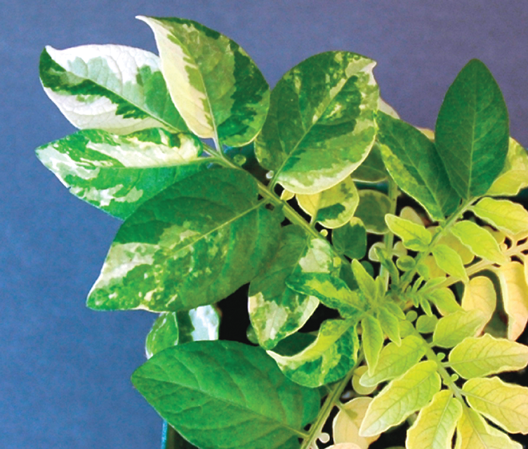
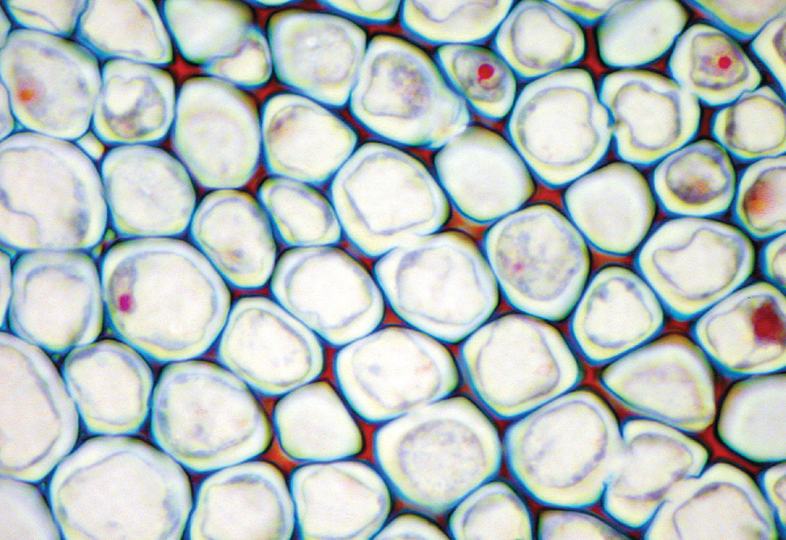
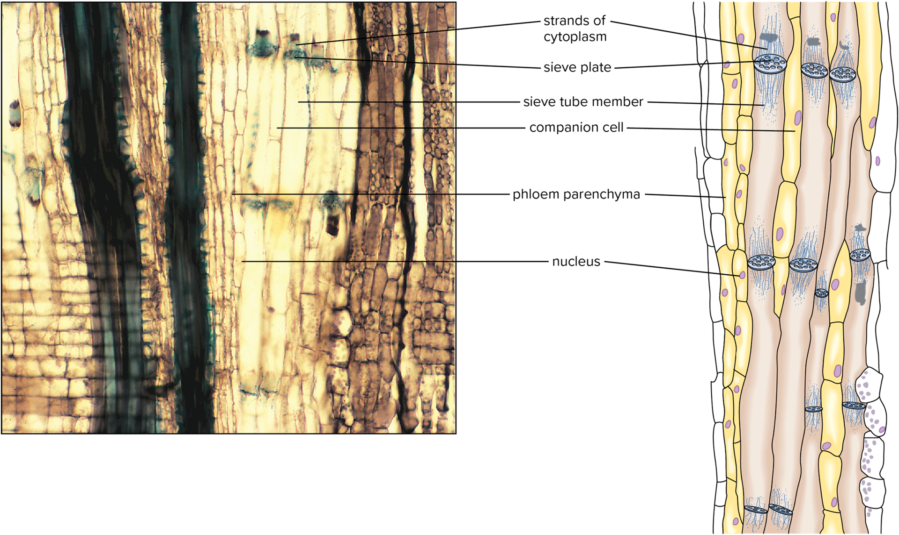

01-20-2024

# Chapter 4 - Tissues

## 4.1 Introduction to Tissues

most plants have four major groups of organs: roots, stems, leaves and often flowers

**Plant Tissue** - group of cells performing the same function
    - Simple tissues are made of a single cell type, whereas complex tissues are made of two or more cell types

## 4.2 Meristematic Tissues

**Meristems** - permenant regions of growth, where cells actively divide
    - small, six-sided, boxlike cells which usually lack vacuoles and have a centrally located, relatively large nucleus

### Apical Meristems

**Apical Meristems** - merismatic tissues found at, or near the tips of roots and shoots which increase in length as the apical meristems produce new cells, known as primary growth
    - Cell in apical meristems divide and produce new cells that are pushed out of the meristem itself

**Primary Meristems** - results of primary growth
    - examples: **protoderm, ground meristem and procambium**
    - tissues produced are called primary tissues

### Lateral Meristems

**Lateral Meristems** - produce tissues that increase the girth of roots and stems - *secondary growth*

#### *Vascular Cambium*

**Vascular Cambium** - producer of secondary tissues
    - functions include support and conduction

#### *Cork Cambium*

**Cork Cambium** - thin cylindar that runs the length of roots and stems of woody plants

### Intercalary Meristems 

- Grass doesnt have either traditional meristem but has **nodes** (leaf attachment areas) and meristematic tissues called *intercalary meristems*
    - intercalarys found in the vacinity of stem nodes and add to length of stems

## 4.3 Tissues Produced by Meristems

### Simple Tissues

**Parenchyma** - tissue is composed of these types of cells
    - function in photosynthesis and storage
    - most abundant of the cell types and found in almost all major parts of higher plants
    - Parenchyma with numerous chloroplasts (leaves) are called **chlorenchyma** tissue
    - thin cell walls, 14 sided
    - contain starch grains, oils, tannins and other secretions

**Collenchyma** - have living cytoplasm and may remain alive a long time
    - main function is to provide support for plant systems
    - walls are thicker and more uneven then parenchyma cells
    - example: strings in celery strands

^ collenchyma cells

**Sclerenchyma** - - tissue consists of cells that have thick, rigid, tough seconday walls normally impregnated with *lignin*
    - mostly dead at maturity
    - two forms: sclereids and fibers
    - *fibers* - longer than wide and have a have cavity at center, found in tissues in roots stems leaves and fruits

### Complex Tissues

**xylem** and **phloam** transport water ions and soluble foods (sugars) throughout the plant

**epidermis** - forms protective layer coverring all plant organs consists of parenchyma cells but also has specialzed cells for moving water and gases in and out of plants
    - typically one layer of cells thick
    - [**cuticle**](#epidermis) - protective layer covering epidermis
    - plants can increase the absorptive surface are of their roots by making **root hairs**, root hairs = tubular extensions of epidermal cells

**Periderm** - outer bark of woody plants - mostly cork cells with pockets of parenchyma cells
    - In woody plants, the cork cambium produces new tissues that increase the girth of the stem. When this happens, the epidermis is sloughed off and replace by Periderm

**xylem** - component of the plumbing and storage systems of plants and is chief confucting tissue in all organs for water and minerals absorved by the roots
    - Vessel elements have thick secondary cell walls and are open at their ends stacked on long tubes called **vessels**
    - perforation plates with holes are found between the end walls of each pair of vessell elements
    - **Tracheids** - dead at maturity, have thick seconday cell walls and are tapered at their ends
    - can also find fibers and parenchyma cells here
    - conducting cells = tracheids and vessels

**phloam** - conducts dissolved food materials (sugars) produced by photosynthesis throughout the plant

^ phloam on a black locust tree

### Epidermis

**trichomes** -  epidermis of aboveground plant parts form outgrowths consisting of one or several cells   
    - found on aboveground parts of plants

**cuticle** - exceptionally resistant to pathogens, including bacteria and viruses.
    - determines how much water is lost through evaporation
    - **cutin** - fatty substance that makes up the cuticle, covers the epidermis
    - bordered by specialized cells called guards

**stomata** - numerous small pores in leaves

- The relatively large sieve tube members, are also known as sieve tube **elements**,  Closely associated with them are narrower, more tapered **companion**.

### Periderm

### Secretory cells and Tissues

