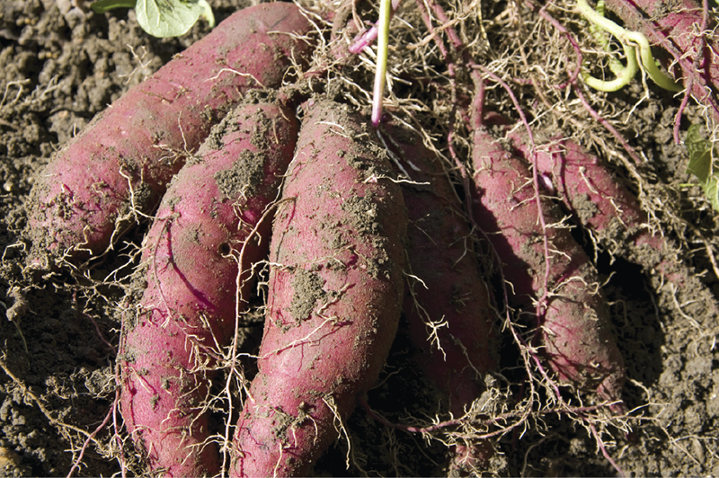
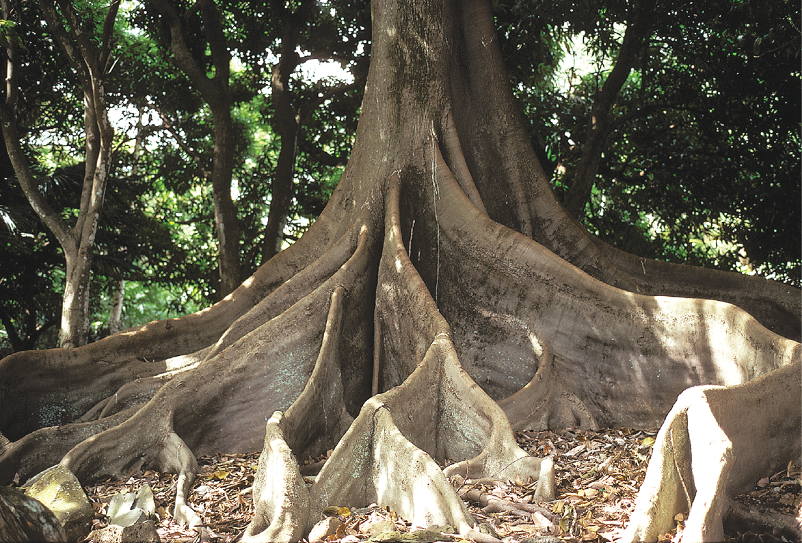

01-27-2024

# Chapter 5 - Roots and Soils

**Root** - part of a plant that anchors it in the soil
    - plants absorb water and minerals from soil through roots

## 5.2 How Roots Develop

- **embryo** - tiny immature plant
    - captured within a seed that contains a rottlike radicle

- **root hairs** - enhanse the absorptive capacity of roots

- **Taproot** - root system characterized by a single large root with smaller branch roots
- **Fibrous Root** - system with many smaller roots of similar diameter

## 5.3 Root Structure

- Young roots divided into four regions(zones)
    1. Root cap
        - cluster of parenchyma cells covering the tip of the root
        - protects the root tip as it pushes through the soil
        - without cap, roots grow randomly instead of down, suggests caps help plants tell gravity
        - **amyoplasts** - plastids containing starch grains, help act as gravity sensors
    2. region of cell division
        - composed of an apical meristem - where division occurs
        - cells divide here every 12 to 36 hours
    3. region of elongation
        - merges with the apical meristem, extends 1 cm from tip of the root
        - Cells in the region of elongation become several times longer than wide
    4. region of maturation
        - tissues mature or differentiate into various distinctive sizes here
        - also called root hair zone
        - **cortex** - cells here are for food storage

**vascular cylinder** - All tissues interior to the endodermis

## 5.4 Specialized Roots

- Food Storage Roots
    - some plants have enlarged roots for storing large quantities of starch and carbs

^ Sweet potato enlarged to store starch/carbs

- Water storage roots
    - ex. pumpkin family stores water
    - mostly plants in arid conditions
    - can weigh over 30 kg

- Propagative Roots
    - Plants produce suckers called **adventitious** buds, buds outside the stems along roots that grow near surface or ground'
    - these rooted buds called suckers can be seperated from root and grown seperately

- Pneumatophores 
    - spongy outgrowths
    - Plants growing in water need to have their roots grow above the surface of the water to gather enough oxygen

- Aerial Roots
    - roots extend beyond the ground
    - corn, mangroves, screw pines are **prop** versions of aerial roots

^ *ficus* tree with roots above ground

- Contractile Roots
    - roots pull plant deeper into soil

- Buttress Roots
    - Trees in shallow soil grow these for stability

^ fig tree with buttress roots

- Parasitic Roots
    - have no inherent chlorophyl and and depend on other plants for nutrition
    - parasitize using projections called **haustoria**

## 5.5 Mycorrhizae

- **Mycorrhizae** - association of the roots with fungi
    - both root and fungi benefit, mutualistic relationship
    - The plant provides organic food; the fungus provides mineral nutrients
    - both depend on one another
    - known as **symbiosis**
    - soils with extreme pH kill these guys

## 5.6 Root Nodules

- some enzymes allow them to convert nitrogen to nitrates, substances readily absorbed by roots

## 5.7 Human Relevance of Roots

- Beets turnips, rudabegas
- Crops that are cultivated that complete their life cycle in two seasons
    - store food in swollen taproot
- key source of **starch**
- **cassava** - tropical crop yields more starch / hectare than any other
 
## Soils 

- Soil contains small and large particles of minerals and organic matter, along with living organisms, air and water
    - pore spaces in the soil are shared by air and water
        - large pore hold air, small pores hold water
    - solid portions of soil made of organic and mineral matter
    - organized into layers or **horizons**
        - top to bottom: A1, A2, Bt1, Bt2, C

- Dynamic, complex and changing part of earths crust
- Soil formation is influenced by the interaction of parent material, topography, vegetation, living organisms, and climate over time
    - begins when rocks are broken down into **parent** material
        - collects and creates rock (sedimentary, metamorphic and igneous)
    - **silt** contain particles only seen with light microscope, vs **sand** where you can see parts with eyes
        - **clay** even tinier

- Living organisms add to soil by:
    - decomposing organic material
    - adding organic material (waste)
    - adding carbon dioxide

The best topography for *soil development* is one that permits **drainage** without erosion because if water accumulates, then the activities of organisms in the soil are interrupted and the development of soil is arrested

- **field capacity** - ability of soil to hold water
    - influenced by texture and organic content

- pH affects plant growth indirectly by changing availability of nutrients
- Water found in soils
    - gravitational water
    - hygroscopic water
    - capillary water
        - water left in soil pores after rain and drainage of gravity water
        - plants mainly depend on this water

- Parent material
    - rocks that havent broken down yet
    - water freezes into rock and splits rock

- Climate
    - Role of weathering rocks varies in different climates