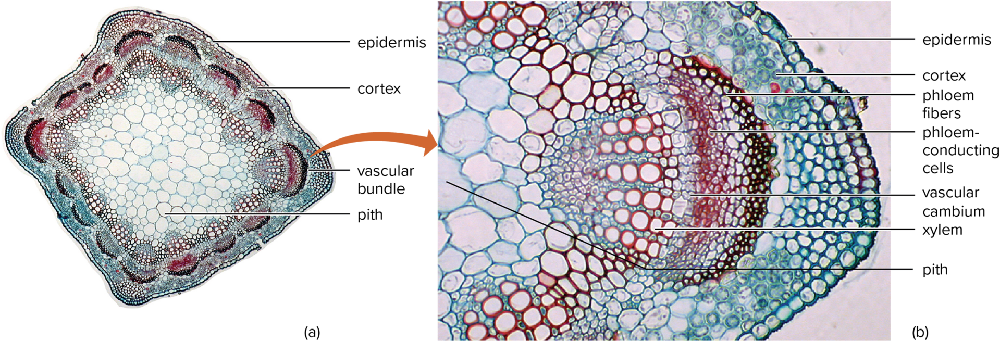
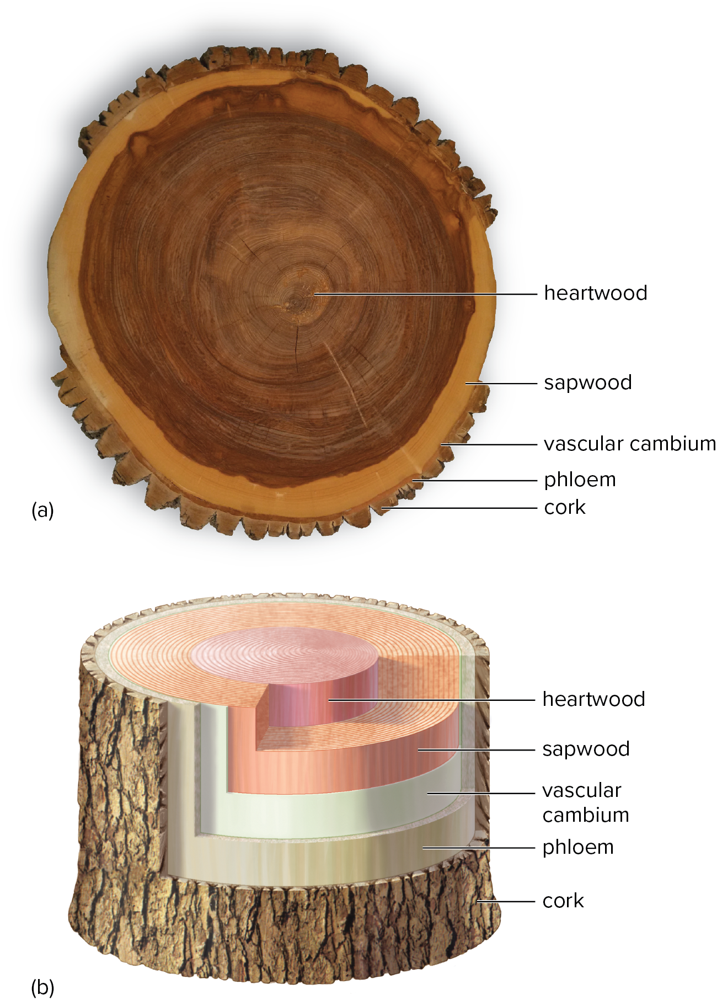
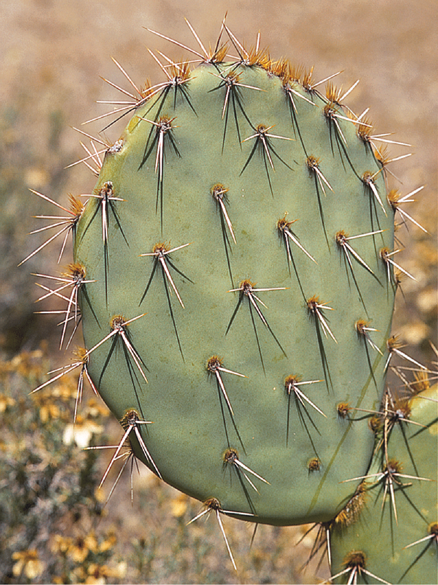

02-03-2024

# Chp 6 - Stems

**perennial grass** - many upright stems, connected underground by horizontal stems 

**oak tree** - a prominent woody stem that grows larger each year 

**sunflower** - a single prominent green stem 

**shoot system** - above ground, non-reproductive part, composed of stems and leaves

## 6.2 - External Form of a Woody Twig

- **Woody Twig** - axis with attched leaves
    - if attached alternatevely theyre called alternate
    - if attached in pairs their called opposite
    - whorled - groups of 3 or mor on stem
    - **node** - where leaf is attached to stem
    - between node region = **internode**
    - **blade** flattened part of leaf attached to twig by **petiole**
    - **axillary** buds located at angle between petiole and stem

- angles bretween stem and petiole contain **bud**
    - angle of the bud is **axil**
    - protected by bud scales
    - terminal bud - located at tip of twig
        - leave scars on twig when they fall off
    - scars left from **stipules** at base of petiole

- **Deciduous** - trees and shrubs that lose their leaves annually
    - generally have dorman auxillary buds with leaf scars below them
    - **bundle scars** - mark location of water/food-conducting tissues

- **Tree Ring** - Spring wood in trees has bigger xylem cells, and summer wood has smaller xylem cells. This results in alternating bands that display annual growth
- Tree Trunk - primarily made up of secondary xylem

## 6.3 - Origin and Development of Stems

- Apical Meristems at the tip of each stem
    - protected by bud stems
    - **primordia** - embryonic leaves that develop into mature leaves after bud stem falls off
    - Bud expands and undergoes mitosis and develops 3 primary meristems
        - **protoderm** - outermost meristem, gives rise to epidermis
            - epidermis covered in waxy cuticle
        - **procambium** - strands, develop on interior of protoderm
            - produces primary xylem for conducting water
            - && primary phloem for conducting food
        - **ground meristem** - all other meristem tissue, composed of parenchyma cells
            - produces **cortex** - stores food ,if chloroplasts present then it also produces food
            - **pith** - made from parenchyma cells, located at center of stem, produced in ground meristem 
- **Indeterminate growth** - ability of plants to grow larger throughout their lifetime
- Vascular Cambium - produces phloam on outside and secondary xylem on inside
    - xylem = tracheids, fibers, vessel elements
    - produces companion cells and sieve tube members
- Cork cambium
    - cork cells that die after formation 
    - become impregnated with suberin which makes them impervious to water

## 6.4 - Tissue Patterns in Stems

#### Steles

- central cylinder composed of primary xylem/phloam and pith
- **Cotyledons** - seed leaves attached to embryonic stems of flowering plants
- **Dicotyledons** - (dicots) flowering plants that develop from cotyledons
    - if only one, then monocotledons (monocot)

#### Herbaceous Dicotyledonous Stems

- **Annuals** plants that grow from seed to maturity in one season
    - have green herbaceous (non woody) stems
    - tissues are primary except for cambia
    - **vascular bundles** - patches of xylem and phloem in dicot stems

- Some tropical trees produce wood that is ungrained because the vascular cambium is active year-round.

#### Woody Dicotyledonous Stems

- Seconday xylem develops (wood)

#### Monocotyledonous Stems

## 6.5 - Specialized Stems

#### Rhizomes

- Horizontal stems that grow below ground, near the surface
    - food storage organ, quite slender

#### Runners and Stolons 

- **Runners** - horizontal stems that grow aboveground, long internodes
- **Stolons** - similar to runners but below surface and not horiz

#### Tubers

- internodes at the tips of stolons swell from food accumulation in potato pants and become **tubers**

#### Bulbs

- large buds surrounded by numerous fleshy leaves, small stem on lower end
- swollen underground buds with *adventitious* roots
- onions

#### Corms

- Stem tissue except scaley leaves on outside
- composed of stem tissue

#### Cladophylls 

- stems are flattened and appear leaflike
- butchers broom, greenberries, pickly pear cacti

#### Other special stems

- stems of cacti are stout and fleshy for food and water storage
- Stems form thorns 
- climbing plants form **tendrils**, have adhesive-like disks
    - modified leaves or stems

## 6.6 wood and its uses

- used for fuel, shelter, weapons, etc for humans
- 50% of weight of wood is water
    - other main components are **lignin and cellulose**
    - celllose is most numerous
    - lignin makes walls of xylem tough, influencing strength of wood

- Trees that exhibit indeterminate growth can do which of the following 
    - Grow longer at their branch tips
    - Grow bigger around

#### Properties of Wood

- **Density**
- **Durability**
- **Types of Sawing**
- **Knots**
- **Wood Products**