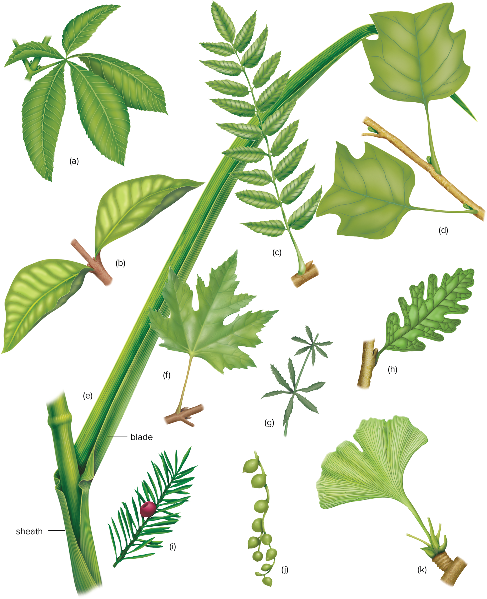
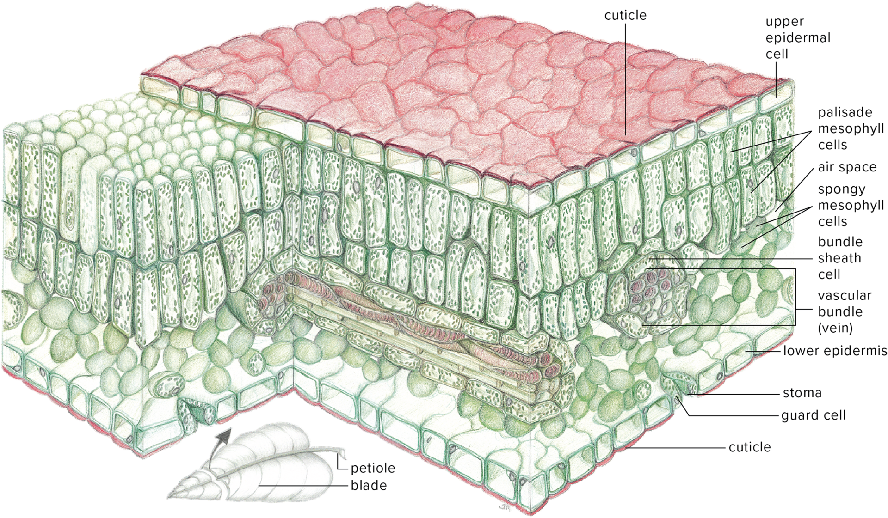

02-09-2024

# Ch.7 - Leaves

- **Leaves** 
    - posiiton maximizes light interception
    - originate as **primordia**
    - **petiole** = stalk
    - flat part = **blade**
        - network of veins  
        - maximize photosnthetic capacity by being flat
    - **decidous** - trees only live through one growing season
        - goes through **abscission** before it looks bare
    - In leaves, the vascular bundles are surrounded by the **bundle sheath**, a layer of thicker-walled parenchyma cells
        - contain xylem and phloam

## 7.2 - Leaf Arrangements and Types

- leaves attached to stems at **nodes**
- **alternate arrangement** - one leaf per node, attached in a spiral
- **opposite arrangement** - two leaves attached to a node
- **whorled** - three or more leaves at one node

- Leaf shapes
    - **compound** - leaf whose blade is divide into leaflets
    - **simple** - blade of leaf is undivided

- Vein arrangement
    - Leaf vein - vascular bundle
    - **pinnately** veined 
        - one primary vein called **midvein** included within large **midrib**
        - secondary veins branch from midvein
    - **palmately veined** - several primary veins fanning out from the base of the blade, with smaller secondary veins branching along the primaries
    - **dichotomously veined** - no large veins present, instead veins fork evenly and progressively from the base of a leaf to its opposite edge

- Dicots = netted veins
- monocots = parallel veins

## 7.3 - Internal Structure of Leaves

- Epidermis (covered by a layer of cutin) protects the leaf
    - glands are in the epidermis, they secrete stuff

## 7.4 - Stomata

- **stomata** - tiny pores in the lower epidermis
    - guard cells - surround openings
    - evaporation through here can cool the leaf
    - Carbon dioxide diffuses into the leaves where it can be taken up and used for photosynthesis
    - Water vapor evaporating from the interior cell surfaces diffuses out into the atmosphere
- **tranpiration** - water evaporates from the moist inner cells at the leaf surface
    - amount of water that moves is determined by amnt of water evaped

## 7.5 - Mesohpyll and Veins

- **Mesophyll** - most of photosynthesis takes place takes here
    - between two epidermis layers
    - **palisade** - compact stacts, column shaped cells

## 7.6 - Specialised Leaves

- **Shade Leaves** - large leaves produced in a region of the plant that receives little sunlight
- leaves in arid env - **succulent leaves**
    - sunken stomata
    - succelent water retaining leaves
    - dense hairy coverings 
- Submerged aquatic plants 
    - mesophyl not organized in layers, larger than normal air spaces
    - Large air spaces are found in the mesophyll 
    - They have significantly less xylem than phloem
- **Tendrils** - leaves curl tightly around object
    - help plants climb
- Storage leaves
    - store carbs
        - onions, lillies
- **Spine** - modified leaf with spiny structures
- **Succulent plants** - produce window leaves
    - leaves with transparent tips that can photosynthsize even when buried
- **Reproductive plants** - produce plantlets
    - reproductive leaves - produce complete plantlets along their margins
- **bracts** brightly colored leaves surround inconspicuous flower
- **Insect Trapping plants** 
    - grow in areas with limited nitrogen
- **Changing color**
    - pigments: carotenes, canthophylls, anthcyanins make leaves colorful

When a plant makes flower-pot leaves, typically ants carry in soil and generate nitrogen-rich wastes. The plants, in turn, will start to grow their roots into this "fertilized" pocket of soil