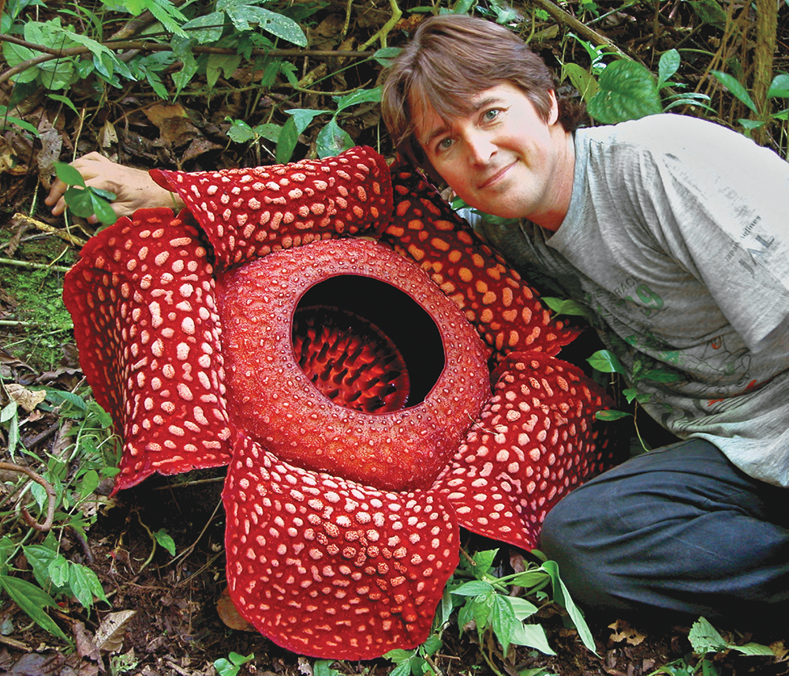
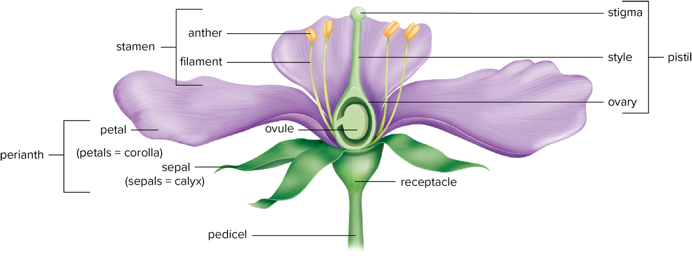
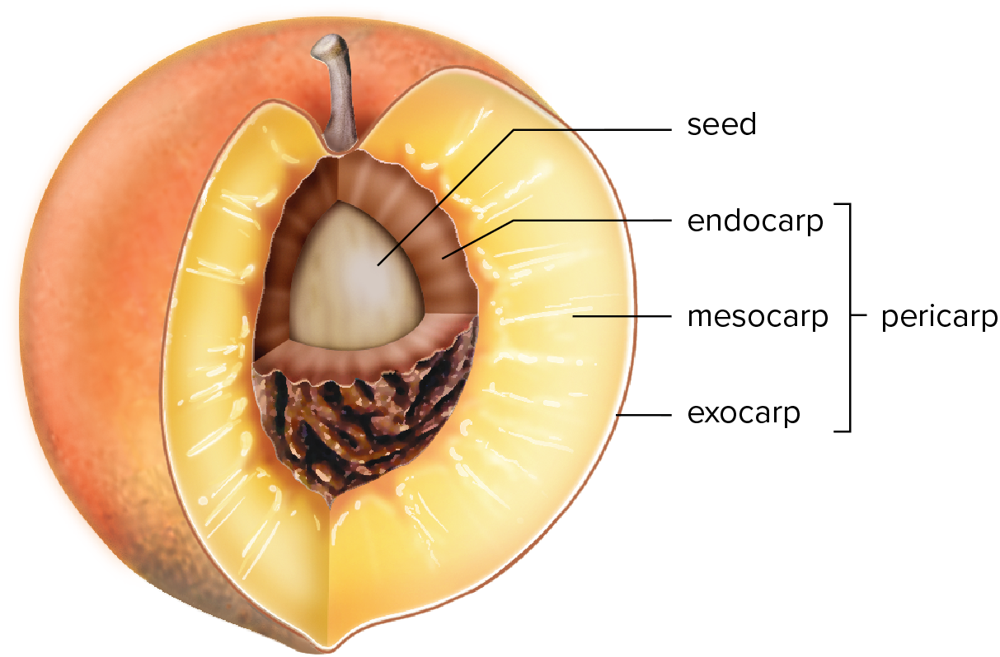

02-13-2024

# Chp 8 - Flowers, Fruits, Seeds

## Dicots vs. Monocots 

- Monocots
    - Species that produce bulbs
    - parallel leaf veins
- Dicots
    - 3/4 of all flowering plants
    - shrubs
    - most flowering trees

## 8.3 - Structure of Flowers

- 300'000 species of flowering plants discovered
- flower begins as *primordium* and develops into a *bud* 
    - occurs at specialized branch at the tip of the stalk called **penducle**
    - may have smaller stalks called **pedicels** 
    - **Receptacle** swolen tip fo peduncle or pedicel
    - plant must have ovules that were successfully fertilized.

- leafy bit called **sepals**
    - may be fused together and called **calyx** - outermost whorl of flower
- next layer called **petals** - usually three or more
    - function to attract pollinators
    - **corolla** - collective name of petals
- Calyx/corolla combo is called **perianth**
- **Stamens** - male part of the flower
    - **filament** - semi-rigid slender
    - **anther** sac on top of filament
    - **Anthers** - where pollen grains are made
        - pollen released here to help fertalize
- **Pistil** female part of flower
    - **stigma, style, ovary** top to base of pistil
        - contains 1 or more ovules

## 8.4 - Fruits

Fruit - any ovary and its accessory parts that has developed and matured

- usually contains one or more seeds from ovules
- produced only from the flowering of plants
    How many ovaries are involved in making the fruit

    Whether it is fleshy or dry

    Whether or not it splits

### Fruit Regions

### Kinds of Fruits

- Fleshy fruits
    - Its mesocarp is at least partly fleshy.
    - develop from a flower with a single pistil
    - superior or inferior ovary
    - **drupe** - fleshy fruit with single seed enclosed by a hard stony endocarp, or pit
        - coconut, cherry, almond
    - **berries** - develop from compound ovary
        - endicarp is fleshy
        - contain several seeds
    - **Pomes** - most of the flesh is enlarged floral tube
        - endocarp is papery or leathery
        - apple, pears, most of flesh grows over ovary
- Dry fruits
    - fruits whose mesocarp is dry at maturity
    - dry fruits that split (**dehiscent**)
        - **follicle** splits along one side or seam, exposes seeds
            - columbine, peony, milkweed, larkspur
        - **legume** - splits along two sides or seams
            - peas, beans, lentils, carob, kudzum, mesquite
        - **Siliques** - split along two sides on a central partition that exposes two sides of fruit
            - broccoli, cabbage, radish
        - **Capsule** most common splitted dry fruit
            - orchids, lillies, poppies, violets
    - dry fruits that dont split
        - **achene** base of seed 
        - **Nuts** larger with hard pericarp
            - acorns, hazelnuts

- **aggregate fruits**
    - All fruitlets mature as a clustered unit.
    - They are derived from a single flower.
    - Individual pistils develop into small fruitlets.

- Cotyledon - food storage
- Billy Beal 1879
    - buried 20 kinds of weed seeds
    - 3 were germinated by 1980

- In angiosperms, double fertilization refers to the fact that one sperm nucleus fertilizes the egg, and the other sperm nucleus unites with the two central cell nuclei
- In most angiosperms, the formation of the endosperm is unique in that the nucleus is triploid
- Seed dormancy is designed to keep seeds from germinating at the wrong time. What are some ways that seed dormancy can be broken?
    - Mechanical abrasion of the seed coat
    - Alternately thawing and freezing the seeds
    - Scarification to break the seed coat

Select all of the following that are true statements concerning the endosperm in most angiosperms

It is a major development unique to angiosperms.

It has a triploid nucleus.