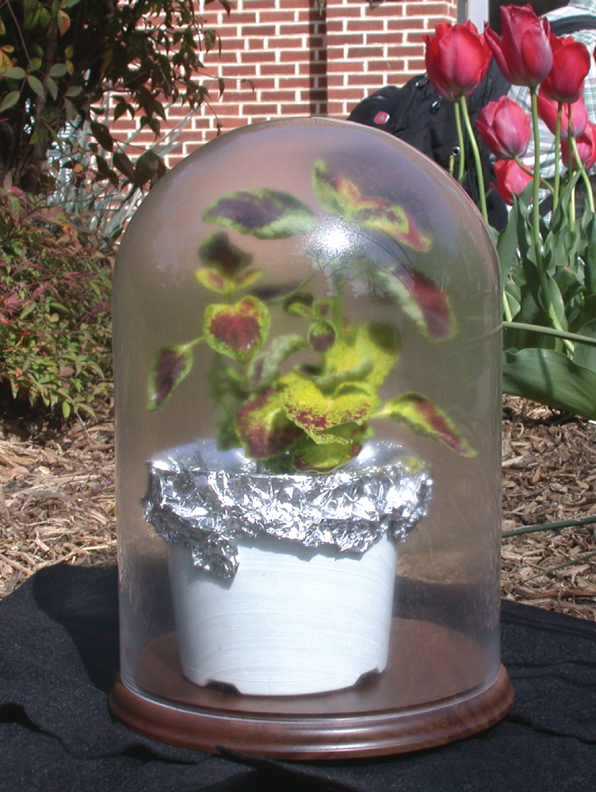
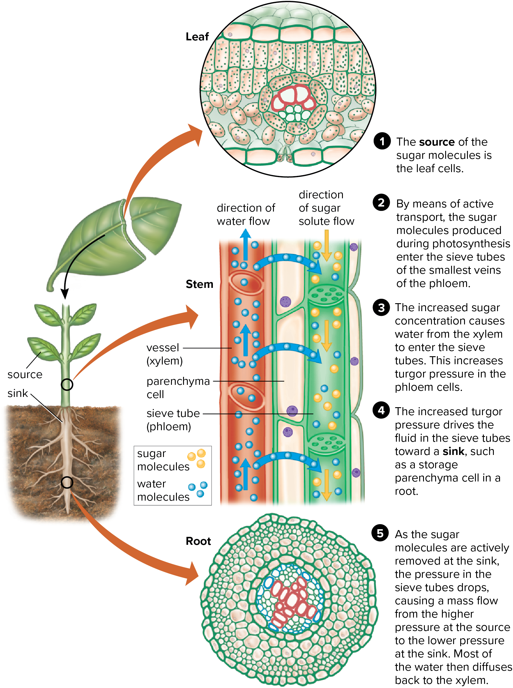

02-25-2024

# Chapter 9 - Water in plants

## 9.2 - Molecular Movement

- **Diffusion** - movement of molecules/ions from a region of higher concentration to a region of lower concentration
    - move along a *diffusion gradient*
        - where adjacent areas have different concentrations of a molecule
    - when distrubuted throughout the environment theyre in *equilibrium*
    - rate of diffusion depends on temp, pressure, density of the medium
- **solvents** - liquids in which substances dissolve
- **Osmosis** - diffusion of water through semipermeable membrane from a region where water is more concentrated to an area where its less concentrated
    - does not require energy to move across membranes
    - **semipermiable membrane** - different substances get through @ different rates
    - Potentials
        - **Osmotic Potential**
            - measure of the potential of water to move from one cell to another
            - influenced by solute concentration
        - **Pressure Potential**
            - **turgor pressure** - develops against the walls as water enters the vacuole of the cell
                - makes plant cells rigid
                - if pressure lost, plant will wilt 
                - requires cell walls to constrain the expansion of cell as they take in water
            - water enters until osmotic potential is balanced by the resistance to expansion of cell wall
        - **Water Potential** - osmotic potential + pressure potential
- **Plasmolysis** - loss of water through osmosis
    - accomponied by shrinkage of protoplasm away from cell wall
- **Imbition** - swelling of tissues
    - first step in seed germination, growth begins
    - happens whether dead or alive
    - swell to multiple times original volume
    - cellulose molecules get wet and develop electrical charge, attracts more water molecules
- **Active Transport** 
    - proton pump helps to regulate which ions pass through the cell membrane
    - energy is required to move things across a membrane, vs osmosis which requires no energy
    - requires a transport protein
    - energy is expended

- Pathways through plant:
    - across a membrane at endodermis
    - up the stem and into the leaves in the xylem
    - from soil to roots through osmosis
    - evaporation from leaf tissues and **transpiration** into atmosphere

## 9.3 - Water and its Movement through the plant

- evaporation of water molecules from moist mesophyll of leaves helps to keep the plant cool 
- if water loss is greater than whats taken in, stomata close to prevent wilting

- Cohesion Tension Theory
    - water molecules are polar
    - water molecules enter cell via root hairs and cortical cells via plasmodesmata
- Water is most abundant and important substance in plant
    - enzymes need it to function
    - chemical activities such as photosynthesis need this to function
    - plants would lose their rigidity without water

- **Root pressure** allows water to mose through plants
    - example: water exuded from cut pruned plants

## 9.4 - Regulation of Transpiration

- Transpiration
    - driven by evaporation
    - creates tension in xylem
    - most important foce that helps move water across long distances in plants
    - pulls water upward from roots to leaves
- **Stomatal Apparatus** - two guard cells around stoma (opening)
- **Hydathodes** - water droplets produced through these things at the tips of veins in the leaves in herbaceous plants
- **Guttation** - loss of water in liquid form

## 9.5 - Transport of Food Substances in Solution (Organic Solutes)

^ pressure flow hypothesis

- *translocation* - transportation of sugars by the phloem
- **Pressure-flow Hypothesis**  
- CAM photosynthesis
    - happens at night
    - stomata open at night
    - plants convert CO2 to organic acids
    - water loss at bare minimum
- sunken stomata in arid environments
    - filled with epidermal hairs to reduce water loss
    - stomata sunken into **stomatal crypts**
- phloam loading
    - active transport of sugars into sieve tube members

## 9.6 - Mineral Requirements for Growth

- Minerals needed for plant growth are typically dissolved in water and taken up by plant roots from the soil

- Macronutrients
    - potassium, calcium, Mg, P, S, N
- Micronutrients
    - Cl, Fe, Z, B, Cu, Molybedenum
- Mineral uptake

- **casparian strips** - strips in root endodermal cells contain suberin to limit movement of minerals and water